Geog6300: Lab 6
================

## Regression

``` r
library(sf)
library(tidyverse)
library(knitr)
library(tmap)
library(lmtest)
library(car)
```

**Overview:** This lab focuses on regression techniques. You’ll be
analyzing the association of various physical and climatological
characteristics in Australia with observations of several animals
recorded on the citizen science app iNaturalist.

\###Data and research questions###

Let’s import the dataset.

``` r
lab6_data<-st_read("data/aus_climate_inat.gpkg")
```

    ## Reading layer `aus_climate_inat' from data source 
    ##   `/Users/klneighbour0118/GEOG6300_Lab6/data/aus_climate_inat.gpkg' 
    ##   using driver `GPKG'
    ## Simple feature collection with 716 features and 22 fields
    ## Geometry type: POLYGON
    ## Dimension:     XY
    ## Bounding box:  xmin: 113.875 ymin: -43.38632 xmax: 153.375 ymax: -11.92074
    ## Geodetic CRS:  WGS 84 (CRS84)

The dataset for this lab is a 1 decimal degree hexagon grid that has
aggregate statistics for a number of variables:

- ndvi: NDVI/vegetation index values from Landsat data (via Google Earth
  Engine). These values range from -1 to 1, with higher values
  indicating more vegetation.
- maxtemp_00/20_med: Median maximum temperature (C) in 2000 or 2020
  (data from SILO/Queensland government)
- mintemp_00/20_med: Median minimum temperature (C) in 2020 or 2020
  (data from SILO/Queensland government)
- rain_00/20_sum: Total rainfall (mm) in 2000 or 2020 (data from
  SILO/Queensland government)
- pop_00/20: Total population in 2000 or 2020 (data from NASA’s Gridded
  Population of the World)
- water_00/20_pct: Percentage of land covered by water at some point
  during the year in 2000 or 2020
- elev_med: Median elevation (meters) (data from the Shuttle Radar
  Topography Mission/NASA)

There are also observation counts from iNaturalist for several
distinctively Australian animal species: the central bearded dragon, the
common emu, the red kangaroo, the agile wallaby, the laughing
kookaburra, the wombat, the koala, and the platypus.

Our primary research question is how the climatological/physical
variables in our dataset are predictive of the NDVI value. We will build
models for 2020 as well as the change from 2000 to 2020. The second is
referred to as a “first difference” model and can sometimes be more
useful for identifying causal mechanisms.

\###Part 1: Analysis of 2020 data###

We will start by looking at data for 2020.

**Question 1** *Create histograms for NDVI, max temp., min temp., rain,
and population, and water in 2020 as well as elevation. Based on these
graphs, assess the normality of these variables.*

``` r
ggplot(lab6_data,aes(x=ndvi_20_med)) + 
  geom_histogram()
```

    ## `stat_bin()` using `bins = 30`. Pick better value with `binwidth`.

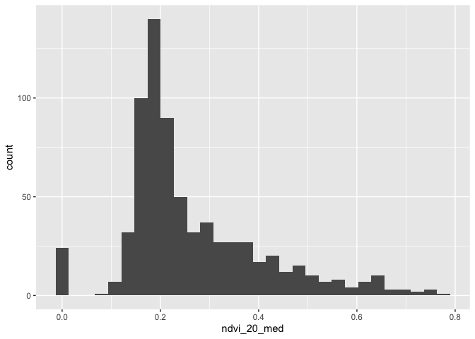<!-- -->

``` r
ggplot(lab6_data,aes(x=maxtemp_20_med)) + 
  geom_histogram()
```

    ## `stat_bin()` using `bins = 30`. Pick better value with `binwidth`.

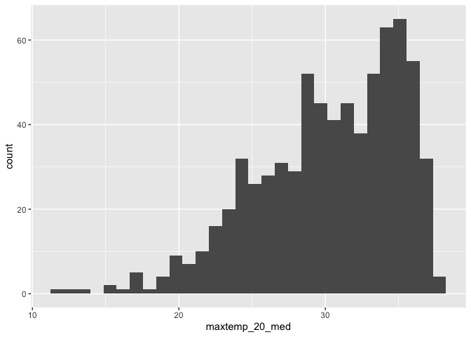<!-- -->

``` r
ggplot(lab6_data,aes(x=mintemp_20_med)) + 
  geom_histogram()
```

    ## `stat_bin()` using `bins = 30`. Pick better value with `binwidth`.

<!-- -->

``` r
ggplot(lab6_data,aes(x=rain_20_sum)) + 
  geom_histogram()
```

    ## `stat_bin()` using `bins = 30`. Pick better value with `binwidth`.

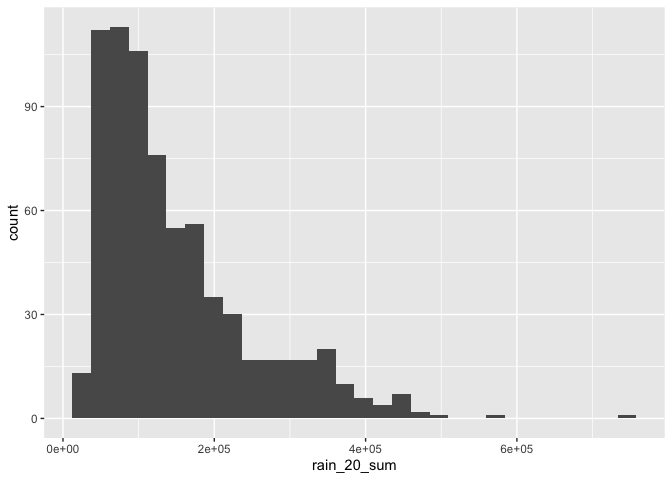<!-- -->

``` r
ggplot(lab6_data,aes(x=pop_20)) + 
  geom_histogram()
```

    ## `stat_bin()` using `bins = 30`. Pick better value with `binwidth`.

<!-- -->

``` r
ggplot(lab6_data,aes(x=water_20_pct)) + 
  geom_histogram()
```

    ## `stat_bin()` using `bins = 30`. Pick better value with `binwidth`.

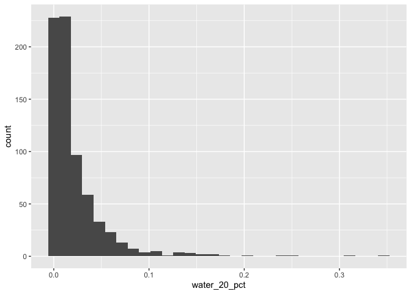<!-- -->

``` r
ggplot(lab6_data,aes(x=elev_med)) + 
  geom_histogram()
```

    ## `stat_bin()` using `bins = 30`. Pick better value with `binwidth`.

<!-- -->

Based on the histograms, here is my assessment of the normality of the
data by variable: - NDVI: positively skewed - Max Temp: negatively
skewed - Min Temp: the most normally distributed out of all the
variables here, even though it is slightly negatively skewed - Rain:
strongly positively skewed - Population: extremely positively skewed -
Water: extremely positively skewed - Elevation: positively skewed

**Question 2** *Use tmap to map these same variables using Jenks natural
breaks as the classification method. For an extra challenge, use
`tmap_arrange` to plot all maps in a single figure.*

``` r
NVDI_map <- tm_shape(lab6_data) +
  tm_polygons("ndvi_20_med", style="jenks", border.alpha=0.5) +
  tm_legend(main.title="NDVI") +
  tm_layout(legend.outside.position = "right",
            legend.outside.size = 0.35,
            legend.outside = TRUE)
  #tm_compass(position=c("right","top"),size = 3) +
  #tm_scale_bar(position=c("center","bottom"))
NVDI_map
```

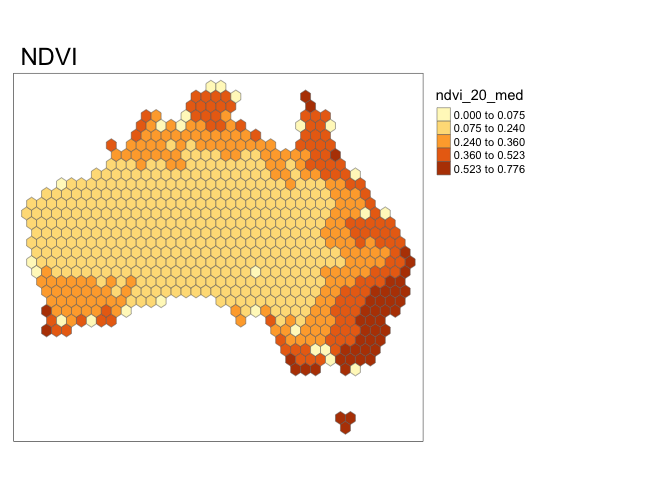<!-- -->

``` r
maxtmp_map <- tm_shape(lab6_data) +
  tm_polygons("maxtemp_20_med", style="jenks", border.alpha=0.5) +
  tm_legend(main.title="Max Temps") +
  tm_layout(legend.outside.position = "right",
            legend.outside.size = 0.35,
            legend.outside = TRUE)
  #tm_compass(position=c("right","top"),size = 3) +
  #tm_scale_bar(position=c("center","bottom"))
maxtmp_map
```

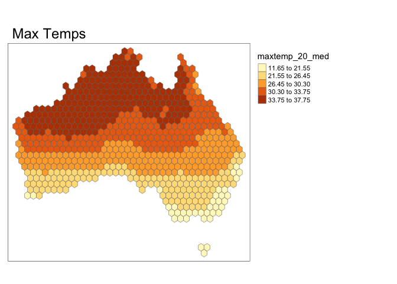<!-- -->

``` r
mintmp_map <- tm_shape(lab6_data) +
  tm_polygons("mintemp_20_med", style="jenks", border.alpha=0.5) +
  tm_legend(main.title="Min Temps") +
  tm_layout(legend.outside.position = "right",
            legend.outside.size = 0.35,
            legend.outside = TRUE)
  #tm_compass(position=c("right","top"),size = 3) +
  #tm_scale_bar(position=c("center","bottom"))
mintmp_map
```

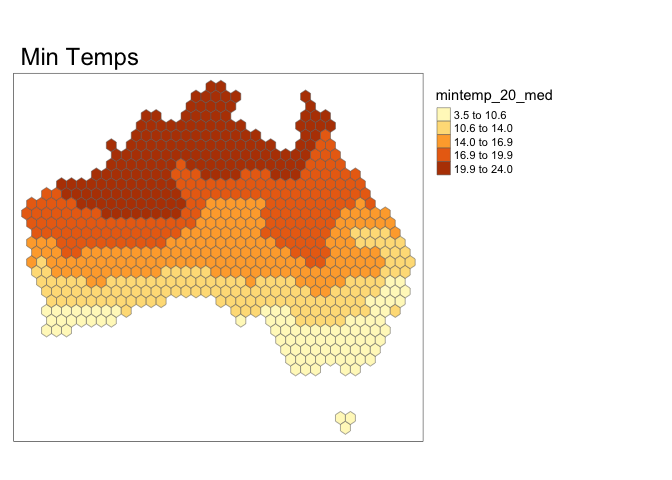<!-- -->

``` r
rain_map <- tm_shape(lab6_data) +
  tm_polygons("rain_20_sum", style="jenks", border.alpha=0.5) +
  tm_legend(main.title="Total Rainfall") +
  tm_layout(legend.outside.position = "right",
            legend.outside.size = 0.35,
            legend.outside = TRUE)
  #tm_compass(position=c("right","top"),size = 3) +
  #tm_scale_bar(position=c("center","bottom"))
rain_map
```

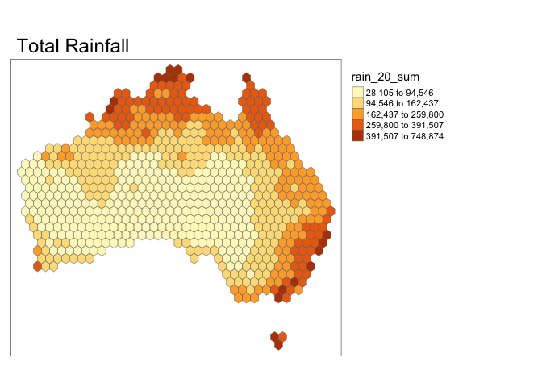<!-- -->

``` r
pop_map <- tm_shape(lab6_data) +
  tm_polygons("pop_20", style="jenks", border.alpha=0.5) +
  tm_legend(main.title="Population") +
  tm_layout(legend.outside.position = "right",
            legend.outside.size = 0.35,
            legend.outside = TRUE)
  #tm_compass(position=c("right","top"),size = 3) +
  #tm_scale_bar(position=c("center","bottom"))
pop_map
```

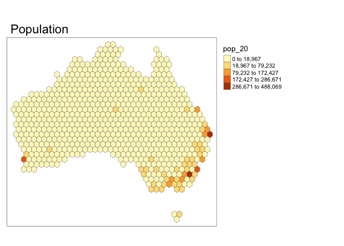<!-- -->

``` r
water_map <- tm_shape(lab6_data) +
  tm_polygons("water_20_pct", style="jenks", border.alpha=0.5) +
  tm_legend(main.title="Water Pct") +
  tm_layout(legend.outside.position = "right",
            legend.outside.size = 0.35,
            legend.outside = TRUE)
  #tm_compass(position=c("right","top"),size = 3) +
  #tm_scale_bar(position=c("center","bottom"))
water_map
```

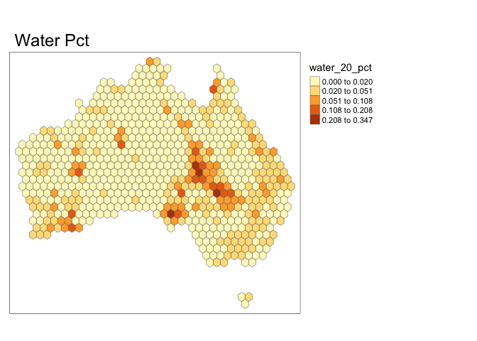<!-- -->

``` r
elev_map <- tm_shape(lab6_data) +
  tm_polygons("elev_med", style="jenks", border.alpha=0.5) +
  tm_legend(main.title="Elevation") +
  tm_layout(legend.outside.position = "right",
            legend.outside.size = 0.35,
            legend.outside = TRUE)
  #tm_compass(position=c("right","top"),size = 3) +
  #tm_scale_bar(position=c("center","bottom"))
elev_map
```

    ## Variable(s) "elev_med" contains positive and negative values, so midpoint is set to 0. Set midpoint = NA to show the full spectrum of the color palette.

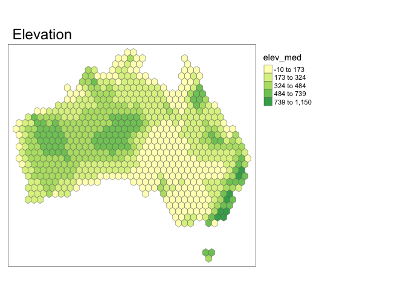<!-- -->

``` r
tmap_arrange(NVDI_map,maxtmp_map,mintmp_map,rain_map,pop_map,water_map,
             elev_map)
```

    ## Variable(s) "elev_med" contains positive and negative values, so midpoint is set to 0. Set midpoint = NA to show the full spectrum of the color palette.

    ## Legend labels were too wide. The labels have been resized to 0.4, 0.4, 0.4, 0.4, 0.4. Increase legend.width (argument of tm_layout) to make the legend wider and therefore the labels larger.
    ## Legend labels were too wide. The labels have been resized to 0.4, 0.4, 0.4, 0.4, 0.4. Increase legend.width (argument of tm_layout) to make the legend wider and therefore the labels larger.

    ## Legend labels were too wide. The labels have been resized to 0.54, 0.49, 0.49, 0.49, 0.49. Increase legend.width (argument of tm_layout) to make the legend wider and therefore the labels larger.

    ## Legend labels were too wide. The labels have been resized to 0.35, 0.32, 0.30, 0.30, 0.30. Increase legend.width (argument of tm_layout) to make the legend wider and therefore the labels larger.

    ## Legend labels were too wide. The labels have been resized to 0.51, 0.35, 0.32, 0.30, 0.30. Increase legend.width (argument of tm_layout) to make the legend wider and therefore the labels larger.

    ## Legend labels were too wide. The labels have been resized to 0.4, 0.4, 0.4, 0.4, 0.4. Increase legend.width (argument of tm_layout) to make the legend wider and therefore the labels larger.

    ## Variable(s) "elev_med" contains positive and negative values, so midpoint is set to 0. Set midpoint = NA to show the full spectrum of the color palette.

    ## Legend labels were too wide. The labels have been resized to 0.57, 0.54, 0.54, 0.54, 0.46. Increase legend.width (argument of tm_layout) to make the legend wider and therefore the labels larger.

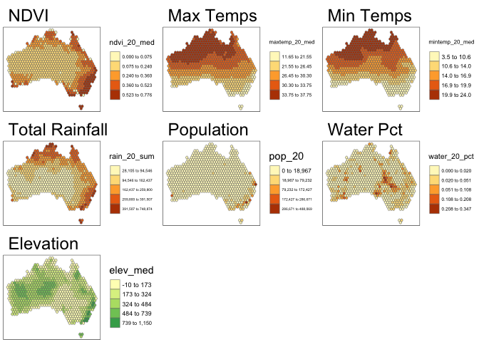<!-- -->

**Question 3** *Based on the maps from question 3, summarise major
patterns you see in the spatial distribution of these data from any of
your variables of interest. How do they appear to be associated with the
NDVI variable?*

The highest values of NDVI tend to be concentrated near the Northern,
Eastern, Southeastern, and Southwestern coasts of Australia. Based on
the maps of the other variables alone, it looks as if total rainfall is
mostly related to NDVI. However, based on previous knowledge, I know
that water cover and total population should also show some correlation
(especially population since I know that population in Australia is
concentrated in the exact same locations). My guess is that because
these two variables are so heavily skewed, it is impossible with this
style of classification to get a good read on the variable’s true
spatial distribution. I’m expecting that both max/min temps and
elevation won’t have nearly as much of an effect on NDVI based on these
maps.

**Question 4** *Create univariate models for each of the variables
listed in question 1, with NDVI in 2020 as the dependent variable. Print
a summary of each model. Write a summary of those results that indicates
the direction, magnitude, and significance for each model coefficient.*

``` r
model1<-lm(ndvi_20_med~maxtemp_20_med,data=lab6_data)
summary(model1)
```

    ## 
    ## Call:
    ## lm(formula = ndvi_20_med ~ maxtemp_20_med, data = lab6_data)
    ## 
    ## Residuals:
    ##      Min       1Q   Median       3Q      Max 
    ## -0.41874 -0.07657 -0.01927  0.06833  0.36382 
    ## 
    ## Coefficients:
    ##                  Estimate Std. Error t value Pr(>|t|)    
    ## (Intercept)     0.6612389  0.0294372   22.46   <2e-16 ***
    ## maxtemp_20_med -0.0130902  0.0009601  -13.63   <2e-16 ***
    ## ---
    ## Signif. codes:  0 '***' 0.001 '**' 0.01 '*' 0.05 '.' 0.1 ' ' 1
    ## 
    ## Residual standard error: 0.1251 on 714 degrees of freedom
    ## Multiple R-squared:  0.2066, Adjusted R-squared:  0.2055 
    ## F-statistic: 185.9 on 1 and 714 DF,  p-value: < 2.2e-16

``` r
model2<-lm(ndvi_20_med~mintemp_20_med,data=lab6_data)
summary(model2)
```

    ## 
    ## Call:
    ## lm(formula = ndvi_20_med ~ mintemp_20_med, data = lab6_data)
    ## 
    ## Residuals:
    ##      Min       1Q   Median       3Q      Max 
    ## -0.36375 -0.08418 -0.03047  0.06972  0.40383 
    ## 
    ## Coefficients:
    ##                 Estimate Std. Error t value Pr(>|t|)    
    ## (Intercept)     0.464461   0.018997   24.45   <2e-16 ***
    ## mintemp_20_med -0.012282   0.001131  -10.86   <2e-16 ***
    ## ---
    ## Signif. codes:  0 '***' 0.001 '**' 0.01 '*' 0.05 '.' 0.1 ' ' 1
    ## 
    ## Residual standard error: 0.1301 on 714 degrees of freedom
    ## Multiple R-squared:  0.1418, Adjusted R-squared:  0.1406 
    ## F-statistic:   118 on 1 and 714 DF,  p-value: < 2.2e-16

``` r
model3<-lm(ndvi_20_med~rain_20_sum,data=lab6_data)
summary(model3)
```

    ## 
    ## Call:
    ## lm(formula = ndvi_20_med ~ rain_20_sum, data = lab6_data)
    ## 
    ## Residuals:
    ##      Min       1Q   Median       3Q      Max 
    ## -0.56681 -0.04753 -0.01210  0.04599  0.30930 
    ## 
    ## Coefficients:
    ##              Estimate Std. Error t value Pr(>|t|)    
    ## (Intercept) 1.303e-01  7.060e-03   18.45   <2e-16 ***
    ## rain_20_sum 9.124e-07  3.953e-08   23.08   <2e-16 ***
    ## ---
    ## Signif. codes:  0 '***' 0.001 '**' 0.01 '*' 0.05 '.' 0.1 ' ' 1
    ## 
    ## Residual standard error: 0.1063 on 714 degrees of freedom
    ## Multiple R-squared:  0.4273, Adjusted R-squared:  0.4265 
    ## F-statistic: 532.6 on 1 and 714 DF,  p-value: < 2.2e-16

``` r
model4<-lm(ndvi_20_med~pop_20,data=lab6_data)
summary(model4)
```

    ## 
    ## Call:
    ## lm(formula = ndvi_20_med ~ pop_20, data = lab6_data)
    ## 
    ## Residuals:
    ##      Min       1Q   Median       3Q      Max 
    ## -0.47003 -0.07883 -0.03949  0.06384  0.48974 
    ## 
    ## Coefficients:
    ##              Estimate Std. Error t value Pr(>|t|)    
    ## (Intercept) 2.552e-01  5.013e-03  50.902   <2e-16 ***
    ## pop_20      1.500e-06  1.500e-07   9.998   <2e-16 ***
    ## ---
    ## Signif. codes:  0 '***' 0.001 '**' 0.01 '*' 0.05 '.' 0.1 ' ' 1
    ## 
    ## Residual standard error: 0.1316 on 714 degrees of freedom
    ## Multiple R-squared:  0.1228, Adjusted R-squared:  0.1216 
    ## F-statistic: 99.97 on 1 and 714 DF,  p-value: < 2.2e-16

``` r
model5<-lm(ndvi_20_med~water_20_pct,data=lab6_data)
summary(model5)
```

    ## 
    ## Call:
    ## lm(formula = ndvi_20_med ~ water_20_pct, data = lab6_data)
    ## 
    ## Residuals:
    ##      Min       1Q   Median       3Q      Max 
    ## -0.26898 -0.08838 -0.04838  0.06871  0.50911 
    ## 
    ## Coefficients:
    ##               Estimate Std. Error t value Pr(>|t|)    
    ## (Intercept)   0.268988   0.006287  42.781   <2e-16 ***
    ## water_20_pct -0.178263   0.154480  -1.154    0.249    
    ## ---
    ## Signif. codes:  0 '***' 0.001 '**' 0.01 '*' 0.05 '.' 0.1 ' ' 1
    ## 
    ## Residual standard error: 0.1403 on 714 degrees of freedom
    ## Multiple R-squared:  0.001862,   Adjusted R-squared:  0.0004636 
    ## F-statistic: 1.332 on 1 and 714 DF,  p-value: 0.2489

``` r
model6<-lm(ndvi_20_med~elev_med,data=lab6_data)
summary(model6)
```

    ## 
    ## Call:
    ## lm(formula = ndvi_20_med ~ elev_med, data = lab6_data)
    ## 
    ## Residuals:
    ##      Min       1Q   Median       3Q      Max 
    ## -0.27082 -0.09585 -0.04270  0.07954  0.44272 
    ## 
    ## Coefficients:
    ##              Estimate Std. Error t value Pr(>|t|)    
    ## (Intercept) 2.138e-01  9.741e-03  21.952  < 2e-16 ***
    ## elev_med    1.787e-04  2.895e-05   6.171 1.14e-09 ***
    ## ---
    ## Signif. codes:  0 '***' 0.001 '**' 0.01 '*' 0.05 '.' 0.1 ' ' 1
    ## 
    ## Residual standard error: 0.1369 on 714 degrees of freedom
    ## Multiple R-squared:  0.05064,    Adjusted R-squared:  0.04931 
    ## F-statistic: 38.08 on 1 and 714 DF,  p-value: 1.136e-09

Model 1: NDVI~Median Max Temp For every increase in 1˚C of median
maximum temperature, the NDVI will decrease by about 0.013. Due to an
extremely low p-value, this coefficient is statistically significant.
The model is somewhat strong due to a R-squared value of around 0.2.

Model 2: NDVI~Median Min Temp For every increase in 1˚C of median
minimum temperature, the NDVI will decrease by about 0.012. Due to an
extremely low p-value, this coefficient is statistically significant.
The model isn’t as strong as the max temp model (R-squared value of
0.14), so I will not be including this in my multivariate regression
model.

Model 3: NDVI~Total Rainfall For every increase in 1 mm of total
rainfall, the NDVI will increase by 9.124 x 10^-7. Since the coefficient
is extremely small, it can also be modeled based off of an increase in 1
meter of total rainfall leading to an increase in NDVI by 0.0009. Due to
an extremely low p-value, this coefficient is statistically significant.
This model is fairly strong with an R-squared value of 0.43.

Model 4: NDVI~Total Population For every increase in 1 person to the
total population, the NDVI will increase by 1.5 x 10^-6. Since the
coefficient is extremely small, it can also be modeled based off of an
increase in 1,000 persons to the total population leading to an increase
in NDVI by 0.0015. Due to an extremely low p-value, this coefficient is
statistically significant. This model isn’t very strong, since it only
has an R-squared value of 0.1228. However, I will still be using this
variable in my multivariate regression model.

Model 5: NDVI~Water Pct For every increase in 1% of land being covered
by water at some point during 2020, the NDVI will decrease by about
0.178. Since the p-value is greater than 0.05, this coefficient is not
statistically significant. In addition, the model shows that there is
almost no relation between the two variables since the R-squared value
is quite small (0.0019). Therefore, I will not be using water pct in my
multivariate regression model.

Model 6: NDVI~Elevation For every increase in 1 m in elevation, the NDVI
will increase by 1.787 x 10^-4. Since the coefficient is extremely
small, it can be also modeled based off of an increase in 1 km in
elevation leading to an increase in NDVI by 0.179. Due to an extremely
low p-value, this coefficient is statistically significant. However,
this model shows that there is almost no correlation between the two
variables since the R-squared value is quite small (0.05). Therefore, I
will not be using elevation in my multivariate regression model.

**Question 5** *Create a multivariate regression model with the
variables of interest, choosing EITHER max or min temperature (but not
both) You may also choose to leave out any variables that were
insignificant in Q4. Use the univariate models as your guide. Call the
results.*

``` r
model_all<-lm(ndvi_20_med~maxtemp_20_med+rain_20_sum+pop_20,data=lab6_data)
summary(model_all)
```

    ## 
    ## Call:
    ## lm(formula = ndvi_20_med ~ maxtemp_20_med + rain_20_sum + pop_20, 
    ##     data = lab6_data)
    ## 
    ## Residuals:
    ##      Min       1Q   Median       3Q      Max 
    ## -0.54167 -0.02238  0.00814  0.03759  0.17686 
    ## 
    ## Coefficients:
    ##                  Estimate Std. Error t value Pr(>|t|)    
    ## (Intercept)     4.922e-01  2.202e-02  22.351  < 2e-16 ***
    ## maxtemp_20_med -1.179e-02  7.012e-04 -16.812  < 2e-16 ***
    ## rain_20_sum     8.648e-07  3.357e-08  25.766  < 2e-16 ***
    ## pop_20          3.024e-07  1.077e-07   2.808  0.00513 ** 
    ## ---
    ## Signif. codes:  0 '***' 0.001 '**' 0.01 '*' 0.05 '.' 0.1 ' ' 1
    ## 
    ## Residual standard error: 0.0872 on 712 degrees of freedom
    ## Multiple R-squared:  0.6158, Adjusted R-squared:  0.6142 
    ## F-statistic: 380.4 on 3 and 712 DF,  p-value: < 2.2e-16

**Question 6** *Summarize the results of the multivariate model. What
are the direction, magnitude, and significance of each coefficient? How
did it change from the univariate models you created in Q4 (if at all)?
What do the R2 and F-statistic values tell you about overall model fit?*

For every 1˚C increase in median maximum temperature, the NDVI will
decrease by about 0.0018. For every 1 mm increase in total rainfall, the
NDVI will increase by about 8.648 x 10^-7. For every 1 person added to
the total population, the NDVI will increase by about 3.024 x 10^-7. All
of these coefficients are statistically significant because their
p-values are less than 0.05. Also, all of these coefficients decreased
in magnitude from their univariate regression model counterparts. A
relatively high R-squared value of 0.6158 shows that the model is a
strong fit for the data. A large F-statistic shows that the model fits
the data better than if there were no/random independent variables,
which shows strong model fit.

**Question 7** *Use a histogram and a map to assess the normality of
residuals and any spatial autocorrelation. Summarise any notable
patterns that you see.*

``` r
lab6_data$residuals<-residuals(model_all)

ggplot(lab6_data,aes(x=residuals)) + 
  geom_histogram()
```

    ## `stat_bin()` using `bins = 30`. Pick better value with `binwidth`.

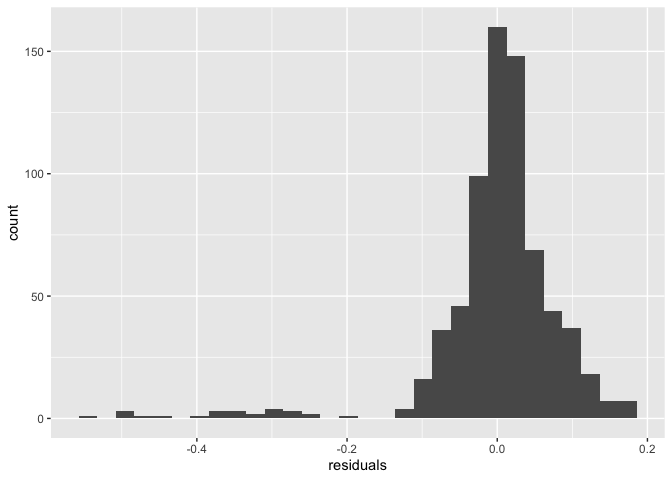<!-- -->

``` r
tm_shape(lab6_data) +
  tm_polygons("residuals", style="jenks", border.alpha=0.5) +
  tm_legend(main.title="Residuals from Multivariate Regression") +
  tm_layout(legend.outside.position = "right",
            legend.outside.size = 0.35,
            legend.outside = TRUE)
```

    ## Variable(s) "residuals" contains positive and negative values, so midpoint is set to 0. Set midpoint = NA to show the full spectrum of the color palette.

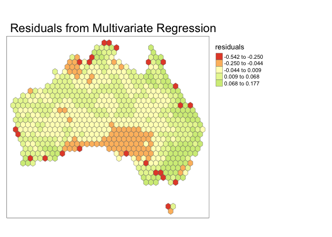<!-- -->

The residuals are negatively skewed. Residuals closer to zero are
concentrated within the center of the country generally away from
coastal areas. The larger residual values are located around the coastal
areas.

**Question 8** *Assess any issues with multicollinearity or
heteroskedastity in this model using the techniques shown in class. Run
the appropriate tests and explain what their results show you.*

``` r
bptest(model_all)
```

    ## 
    ##  studentized Breusch-Pagan test
    ## 
    ## data:  model_all
    ## BP = 65.65, df = 3, p-value = 3.642e-14

``` r
vif(model_all)
```

    ## maxtemp_20_med    rain_20_sum         pop_20 
    ##       1.098341       1.071548       1.173265

Heteroskedastity: Since the Breusch-Pagan test returns an extremely
small p-value (much less than 0.05) we must reject the null hypothesis
that the data is uniform and accept the alternative hypothesis that our
data is heteroskedastic.

Multicollinearity: The Variance Inflation Factor test returned values
less than around 5 for each of the dependent variables, therefore, we
can assume that the independent variables are not correlated.

**Question 9** *How would you summarise the results of this model in a
sentence or two? In addition, looking at the full model and your
diagnostics, do you feel this is a model that provides meaningful
results? Explain your answer.*

In Australia during 2020, median maximum temperature was negatively
related with vegetation cover, while total population and total rainfall
were positively related with vegetation cover. I think the results from
this model are meaningful due to the high R-squared and F-statistic
values, and since the independent variables are not correlated with each
other. However, it is important to use caution when using this model
because the data is heteroskedastic and the residuals are not normal.

**Disclosure of assistance:** *Besides class materials, what other
sources of assistance did you use while completing this lab? These can
include input from classmates, relevant material identified through web
searches (e.g., Stack Overflow), or assistance from ChatGPT or other AI
tools. How did these sources support your own learning in completing
this lab?*

This time, I did not use any other materials for assistance during this
lab (not even Stack Overflow, which has been my usual go-to). The only
resources I used were my class notes and the class R scripts.

**Lab reflection:** *How do you feel about the work you did on this lab?
Was it easy, moderate, or hard? What were the biggest things you learned
by completing it?*

I feel pretty good about the work I did in this lab; it was fairly easy
and straightforward. This lab really solidified for me how to use and
understand both univariate and multivariate regression models in R.
However, I feel like this lab was much more writing than the others,
which I wasn’t necessarily a fan of. Unfortunately, since it’s a really
crazy time for me right now, I do not have time to do the challenge
questions (I really wanted to map kookaburras).

**Challenge question**

\#Option 1 Create a first difference model. To do that, subtract the
values in 2000 from the values in 2020 for each variable for which that
is appropriate. Then create a new model similar to the one you created
in question 5, but using these new variables showing the *change in
values* over time. Call the results of the model, and interpret the
results in the same ways you did above. Also chart and map the residuals
to assess model error. Finally, write a short section that summarises
what, if anything, this model tells you.

\#Option 2 The animal data included in this dataset is an example of
count data, and usually we would use a Poisson or similar model for that
purpose. Let’s try it with regular OLS regression though. Create two
regression models to assess how the counts of two different animals
(say, koalas and emus) are associated with at least three of the
environmental/climatological variables given above. Be sure to use the
same independent variables in each model. Interpret the results of each
model and then explain the importance of any differences in the model
coefficients between them, focusing on direction, magnitude, and
significance.
